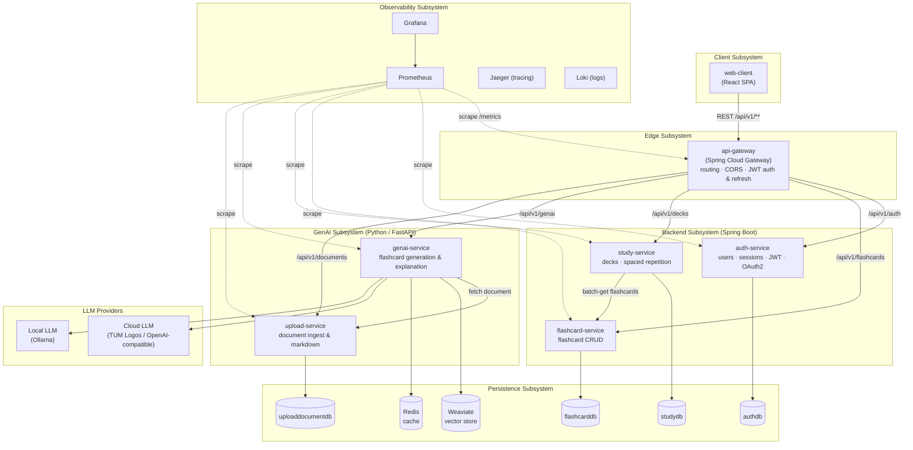

# Subsystem Decomposition

The system is decomposed into a **client** subsystem, an **API gateway**, a set of
**Spring Boot backend microservices** (each owning one bounded context and its own
database), a **Python GenAI subsystem**, and an **observability** subsystem. All
cross-subsystem communication is over HTTP/REST against OpenAPI contracts; each
service owns its own database (no shared tables).

## Subsystem responsibilities & interfaces

| Subsystem | Service | Responsibility | Interface |
|---|---|---|---|
| Client | web-client | Usable, responsive UI (upload, decks, study, flashcards) | REST → gateway |
| Edge | api-gateway | Single entry point: routing, CORS, JWT validation/refresh, identity headers | REST |
| Backend | auth-service | Users, sessions, JWT, Google OAuth2 (`authdb`) | REST (`/api/v1/auth`) |
| Backend | flashcard-service | Flashcard CRUD scoped per user (`flashcarddb`) | REST (`/api/v1/flashcards`) |
| Backend | study-service | Decks + spaced-repetition scheduling (`studydb`) | REST (`/api/v1/decks`) |
| GenAI | genai-service | Flashcard generation & explanation; cloud + local LLMs; RAG | REST (`/api/v1/genai`) |
| GenAI | upload-service | Document ingest → markdown (`uploaddocumentdb`) | REST (`/api/v1/documents`) |
| Persistence | PostgreSQL / Weaviate / Redis | Per-service relational storage, vector store, cache | JDBC / gRPC / RESP |
| Observability | Prometheus / Grafana / Jaeger / Loki | Metrics, dashboards, tracing, logs | scrape / OTLP |
